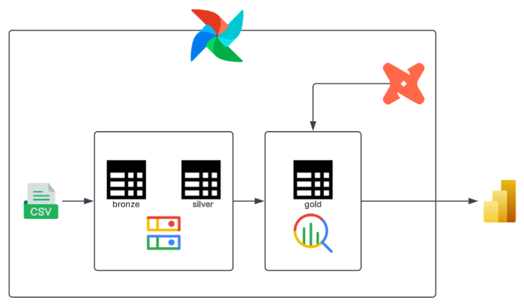
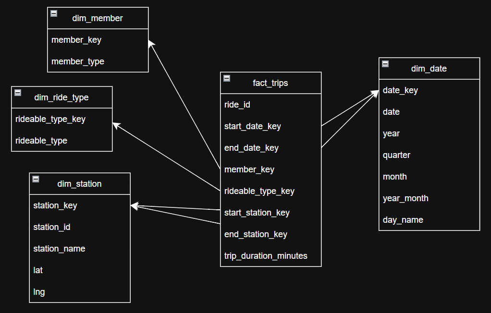
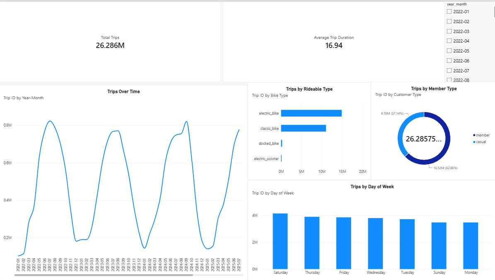

# divvy-trip

> *Transforming millions of raw bike sharing records reveals a striking contrast between the purposeful rush of weekday commuters and the unhurried exploration of weekend riders. Turning chaotic transactional logs into a meaningful narrative of urban movement shows how every processed trip reflects the authentic rhythm of the city far more accurately than isolated statistics*

## Table of Contents

- [Overview](#overview)
- [Architecture](#architecture)
- [Data Quality](#data-quality)
- [Dashboard](#dashboard)
- [Data Sources](#data-sources)
- [Project Structure](#project-structure)

---

## Overview

&nbsp;&nbsp;&nbsp;&nbsp;This project processes public bike share records from Chicago to uncover macro mobility trends and behavioral patterns. By transforming large scale raw transactional data into structured analytical models, the infrastructure enables efficient exploration of ridership dynamics and temporal usage cycles

&nbsp;&nbsp;&nbsp;&nbsp;The resulting datasets highlight distinct operational characteristics, revealing clear contrasts between high frequency commuter activity and leisure journeys. Through automated pipelines, raw logs are systematically validated to deliver strategic intelligence on fleet preferences and peak demand periods

---

## Architecture

&nbsp;&nbsp;&nbsp;&nbsp;Within a centralized environment, a structured multi layer workflow applies to data ingestion and transformation. Having been collected, cleaned, and refined across progressive storage tiers, raw files are turned into validated analytical datasets ready for downstream reporting

<div align="center">
  
</div>

&nbsp;&nbsp;&nbsp;&nbsp;To balance query performance and flexibility, the warehouse relies on a star schema design centered around a main transaction fact table linked directly to dedicated dimension tables representing user profiles, vehicle types, locations, and calendar attributes

<div align="center">
  
</div>

---

## Data Quality

### 1.Completeness

| Column | NULL Count | Status |
| ------ | ---------- | ------ |
| ride_id | 0 | PASS |
| rideable_type | 0 | PASS |
| started_at | 0 | PASS |
| ended_at | 0 | PASS |
| member_casual | 0 | PASS |
| start_station_id | 4659169 | PASS |
| end_station_id | 4892170 | PASS |
| start_station_name | 4659037 | PASS |
| end_station_name | 4892029 | PASS |
| start_lat | 0 | PASS |
| end_lat | 28674 | PASS |
| start_lng | 0 | PASS |
| end_lng | 28674 | PASS |

### 2.Timeliness

| Check | Result | Status |
| ----- | ------ | ------ |
| Data period | 2022-01 -> 2026-07 | PASS |
| Monthly coverage | 55 | PASS |

### 3.Validity

| Check | Columns | Result | Status |
| ----- | ------- | ------ | ------ |
| Allowed Values | rideable_type | electric_bike, classic_bike, docked_bike, electric_scooter | PASS |
| Allowed Values | member_casual | member, casual | PASS |
| Latitude Range | start_lat, end_lat | -90 -> 90 | PASS |
| Longitude Range | start_lng, end_lng | -180 -> 180 | PASS |
### 4.Integrity

| Check | Columns | Result | Status |
| ----- | ------- | ------ | ------ |
| Trip Duration | started_at, ended_at | 628 | RESOLVED |

### 5.Uniqueness

| Column | Check Type| Result | Status |
| ------ | --------- | -------| ------ |
| ride_id | Duplicate | 246 | RESOLVED |

### 6.Consistency

| Check | Status |
| ----- | ------ |
| Schema Consistency | PASS |

---

## Dashboard

&nbsp;&nbsp;&nbsp;&nbsp;Usage fluctuates according to strong annual seasonality, driven by weather patterns that concentrate demand during summer periods before declining sharply throughout winter. Registered members generate the primary baseline of overall trip volume, demonstrating consistent daily utilization compared to the more volatile ride patterns of casual users

<div align="center">
  
</div>

&nbsp;&nbsp;&nbsp;&nbsp;Distinct engagement characteristics differentiate user categories and transport preferences across the network. Casual riders utilize bikes for extended leisure journeys, whereas members complete shorter commute trips. High density urban intersections capture the primary spatial demand, with electric options remaining the preferred choice across all user segments

<div align="center">
  
</div>

---

## Data Sources

&nbsp;&nbsp;&nbsp;&nbsp;Sourced directly from Chicago's public [Divvy trip](https://divvy-tripdata.s3.amazonaws.com/index.html) portal, the underlying dataset captures multi year rider activity across the metropolis. These extensive ride records supply the required historical baseline to evaluate urban transit behavior

---

## Project Structure

```
divvy-trip/
├── divvy_analytics/
├── config/
├── dags/
├── images/
├── jars/
└── src/
    ├── ingestion/
    ├── transform/
    └── utils/
```